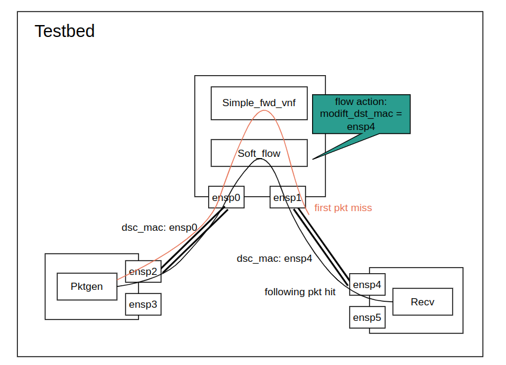

# Clone all with submodule
```
git clone --recurse-submodules https://github.com/quieoo/DODK.git

```

# Prerequisite
## Install DPDK

Prerequistes for DPDK
```
sudo apt install build-essential python3-pyelftools libnuma-dev
```

install the latest meson.build with pip (tested version is 0.61.2, the lower may bring some problem)

```
sudo apt install python3-pip
sudo pip3 install meson
sudo pip3 install ninja
```

Build dpdk

```
cd dpdk
meson build
cd build
ninja
sudo ninja install
sudo ldconfig
```

## Install gRPC-python
Install pip3 if necessary
```
sudo apt install python3-pip
```
or, upgrade the version of pip:
```
python3 -m pip install --upgrade pip
```

Install gRPC:
```
sudo python3 -m pip install grpcio
sudo python3 -m pip install grpcio-tools
```

## Build gRPC-C++
```
sudo apt install -y cmake
cmake --version
sudo apt install -y build-essential autoconf libtool pkg-config
git clone -b v1.46.3 https://github.com/grpc/grpc
cd grpc
git submodule update --init
mkdir -p cmake/build
pushd cmake/build
cmake ../..
make -j4
make install
```
You need version 3.13 or later of cmake.

More deps for grpc++
```
sudo apt-get install openssl
sudo apt-get install libssl-dev
sudo apt-get install libre2-dev
sudo apt-get install libjson-c-dev
sudo apt-get install -y libbsd-dev
```


# Build DODK and install
```
sudo apt install pkg-config
cd DODK
meson build
cd build
ninja
ninja install 
lsconfig
```

Run sample application, for example:
```
./app/simple_fwd_vnf/simple_fwd_vnf -l 0-3 -n 4 -F
```

note: run dpdk application need some extra configrations, such as hugepage, root authority, and dpdk-supported nic.

note: 'F' flag means letting sofe-flow take over the packet processing in DPDK.


## gRPC Orchestrator
On server side (DPU)
```
cd orchestrator
python3 grpc_server.py
```

On Client side (HOST), create remote program
```
python3 grpc_client.py -a 101.76.213.102 -c app_simple_fwd_vnf -s '-l 0-3 -n 4 -ll 2'
```

# TestBed


1. Install VirtualBox and Create a VM with repo cloned. 
2. Build DPDK and DODK as above.
3. Clone the VM. One for DPDK packet process, and one for Pktgen to generate packets
4. Install PktGen
    ```
    git clone https://github.com/pktgen/Pktgen-DPDK.git
    sudo apt-get install libpcap-dev
    cd Pktgen-DPDK/
    meson build
    cd build/
    ninja
    ```
5. Connect 2 VMs with internal network
    
    Add 2 adaptor to DPDK_VM, configure it as internal network. The name are "intnet-1", "intnet-2". 
    Make sure the Adaptor type is "virtio-pci", and "cable connected" is one.

    Add the same 2 adaptor to Pktgen_VM.
6. Boot up two VM, and bind the added 2 nic to DPDK driver.
7. Run the DODK app simple_fwd_vnf with soft_flow
    ```
    ./app/app_simple_fwd_vnf -l 0-1 -n 4 -F
    ```
8. Run the Pktgen to create packets
    ```
    ./app/pktgen  -l 0-1 -n 4 -m 1024 --proc-type auto --file-prefix pg2  -- -P -m "1.0"

    ```
    In Pktgen cmdline, set the dst mac address to the binded nic for DPDK_VM and the packet to send with:
    ```
    set 0 dst mac 08:00:27:DA:C3:19
    set 0 count 10
    start 0
    ```


https://docs.google.com/spreadsheets/d/1dI7oSHMJ7SXu2PUNw-JUQWIxfmGC_o4pDmN15_t6sEk/edit#gid=0
